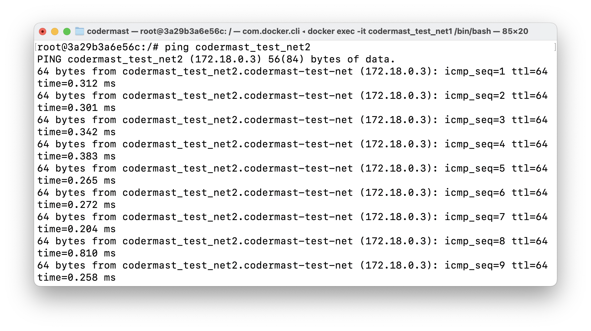
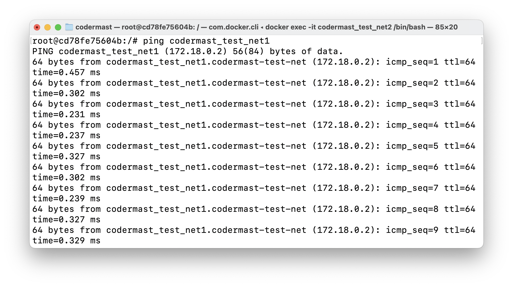

# Docker - 容器互联

在上一个章节中我们学习了 Docker 容器的端口映射，可以将 Docker 容器和本地以及网络中的端口进行连接起来。

但端口映射并不是唯一把 Docker 连接到另一个容器的方法，Docker 有一个连接系统允许将多个容器连接在一起，共享连接信息。


## 容器命名

在创建一个容器的时候，Docker 会自动为其进行命名，也可以使用 `--name` 来自定义 Docker 容器的名称。

- 创建时自定义名称

```sh
docker run -d -P --name codermast training/webapp python app.py
```


- 创建后修改名称

```sh
docker rename focused_boyd codermast1
```

其中 `focused_boyd` 为原容器名，`codermast1` 为要自定义的名称。


## 创建网络

```sh
docker network create -d bridge codermast-test-net
```

- -d：参数指定 Docker 网络类型，有 bridge、overlay。


## 连接容器

1. 创建一个容器并连接到该网络

```sh
docker run -itd --name codermast_test_net1 --network codermast-test-net ubuntu:20.04 /bin/bash
```

2. 创建另一个容器并连接到该网络

```sh
docker run -itd --name codermast_test_net2 --network codermast-test-net ubuntu:20.04 /bin/bash
```


3. 验证该网络下的两个容器建立了联系

使用 ping 指令检测，在执行之前请确保安装了该指令工具，如果未安装，执行下列指令安装即可。

```sh
apt-get update
apt install iputils-ping
```





这样，`codermast_test_net1` 容器和 `codermast_test_net2` 容器建立了互联关系。

如果有多个容器之间需要互相连接，推荐使用 `Docker Compose`，在后续的章节中会进行详细说明，这里不再赘述。

