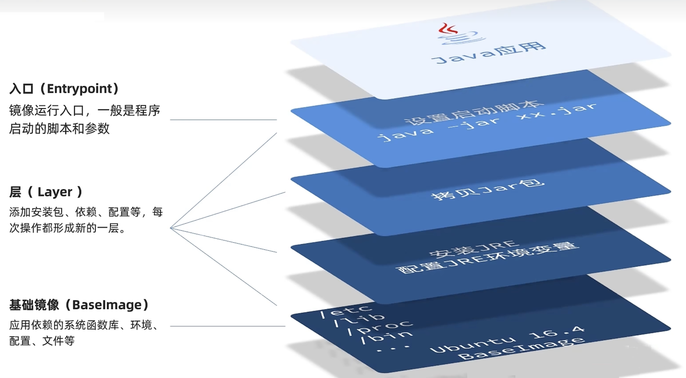

# Docker - Dockerfile

## 什么是Dockerfile？

DockerFile 是用于构建 Docker 镜像的文本文件。Docker 是一种容器化平台，允许开发者将应用程序及其依赖项打包到一个可移植的容器中，以确保在不同环境中的一致性和可移植性。

DockerFile 包含一系列指令，这些指令描述了如何构建 Docker 镜像。每个指令都对应一个操作，例如安装软件包、设置环境变量、复制文件等。当 Docker 引擎读取 DockerFile 时，它会逐行执行其中的指令，以最终创建一个镜像。

## 示例说明

在空目录下，新建一个名为 Dockerfile 的文件，并在其中添加如下内容。

```dockerfile
# 使用官方的基础镜像
FROM ubuntu:latest

# 设置工作目录
WORKDIR /app

# 复制当前目录下的所有文件到工作目录
COPY . .

# 安装依赖
RUN apt-get update && apt-get install -y \
    python3 \
    python3-pip

# 安装应用程序依赖
RUN pip3 install -r requirements.txt

# 暴露应用程序的端口
EXPOSE 5000

# 定义启动命令
CMD ["python3", "app.py"]
```

在上面的示例中：

- FROM 指定了基础镜像，即用作构建的起点的操作系统和环境。
- WORKDIR 设置了工作目录，即后续指令执行时的当前工作目录。
- COPY 将当前目录下的所有文件复制到容器的工作目录。
- RUN 执行命令，例如更新包列表、安装软件等。
- EXPOSE 声明应用程序将监听的端口。
- CMD 定义了容器启动时要执行的默认命令。

通过编写 DockerFile，开发者可以将应用程序的构建过程和运行时环境的配置以代码的方式进行描述，实现了可重复、可移植和可自动化的容器化部署。


## 镜像结构

Docker File 文件中的每条指令都会创建一个新的镜像层，当本地环境中已经下载好了某些镜像，那么会直接使用这些镜像，不会重复下载，提高了效率。

但是过多的层也会导致镜像过大，可以适当进行简化，仅在关键部分进行分层。



## 编写规则

- 每条保留字指令都必须为大写字母且后面要跟随至少一个参数
- 指令顺序执行，遵循从上到下原则
- #表示注释
- 每条指令都会创建一个新的镜像层，并对镜像进行提交


## 指令汇总

- FROM： 指定基础镜像，作为构建的起点。

```dockerfile:no-line-numbers
FROM ubuntu:latest
```

- WORKDIR： 设置工作目录，后续指令将在该目录下执行。

```dockerfile:no-line-numbers
WORKDIR /app
```

- COPY： 复制文件或目录到容器中。

```dockerfile:no-line-numbers
COPY . .
```
- ADD： 类似于COPY，还支持URL解压缩和tar文件自动解压。

```dockerfile:no-line-numbers
ADD https://example.com/file.tar.gz/app/
```

- RUN： 执行命令，通常用于安装软件包、更新系统等。

```dockerfile:no-line-numbers
RUN apt-get update && apt-get install -y python3
```

- ENV： 设置环境变量。

```dockerfile:no-line-numbers
ENV MY_VAR=value
```

- EXPOSE： 声明容器将监听的端口，但并不映射到主机。

```dockerfile:no-line-numbers
EXPOSE 80
```

- CMD： 定义容器启动时要执行的默认命令。可以被覆盖。

```dockerfile:no-line-numbers
CMD ["python", "app.py"]
```

- ENTRYPOINT： 定义容器启动时要执行的默认命令。不可被覆盖，但可以追加参数。

```dockerfile:no-line-numbers
ENTRYPOINT ["nginx", "-g", "daemon off;"]
```

- VOLUME： 创建挂载点，用于持久化数据。

```dockerfile:no-line-numbers
VOLUME /data
```

- USER： 设置执行后续命令的用户或 UID。

```dockerfile:no-line-numbers
USER appuser
```

- ARG： 定义构建时的变量，可通过构建命令传递。

```dockerfile:no-line-numbers
ARG version=latest
```

- LABEL： 添加元数据，通常用于描述镜像。

```dockerfile:no-line-numbers
LABEL version="1.0" description="My custom image" author="codermast"
```


:::tip Docker File 指令官方文档
https://docs.docker.com/engine/reference/builder/
:::

## Docker build

`docker build` 命令用于基于 Dockerfile 创建 Docker 镜像。通过此命令，你可以自动化地构建一个新的 Docker 镜像。下面是 `docker build` 命令的详细解释，包括常见选项和示例。

### 基本语法

```sh
docker build [OPTIONS] PATH | URL | -
```

- `OPTIONS`：构建过程的各种选项。
- `PATH`：Dockerfile 所在目录路径，Docker 会将此路径及其子目录作为构建的上下文。
- `URL`：远程 Dockerfile 所在的 URL。
- `-`：表示从标准输入读取 Dockerfile。

### 常用选项

- `-t, --tag`：为生成的镜像指定名称和标签。例如 `myimage:latest`。
- `-f, --file`：指定 Dockerfile 的路径（默认是当前目录下的 `Dockerfile`）。
- `--build-arg`：设置构建时的变量。
- `--no-cache`：不使用缓存，强制重新构建所有层。
- `--pull`：尝试从注册表中拉取最新版本的基础镜像。
- `--rm`：成功后移除中间容器（默认开启）。
- `--force-rm`：始终移除中间容器。
- `-q, --quiet`：仅在构建时输出镜像 ID。
- `--network`：设置构建时的网络模式。
- `--target`：设置构建的目标阶段（适用于多阶段构建）。

### 示例用法

1. **基本构建**：

   在 Dockerfile 所在目录下执行构建操作。

   ```sh
   docker build -t my-golang-app .
   ```

   - `-t my-golang-app`：指定生成的镜像名称为 `my-golang-app`。
   - `.` 表示当前目录。

2. **指定 Dockerfile 路径**：

   如果 Dockerfile 不在当前目录下，可以使用 `--file` 或 `-f` 参数指定路径。

   ```sh
   docker build -t my-node-app -f path/to/Dockerfile .
   ```

3. **使用构建参数**：

   可以在构建过程中传递构建参数。

   ```sh
   docker build -t my-app --build-arg VERSION=1.0 .
   ```

   Dockerfile 中可以使用 `ARG` 指令定义构建参数：

   ```dockerfile
   ARG VERSION
   RUN echo $VERSION
   ```

4. **不使用缓存重新构建**：

   强制重新构建镜像，不使用缓存。

   ```sh
   docker build --no-cache -t my-python-app .
   ```

5. **从 URL 拉取 Dockerfile**：

   从远程存储库中的 URL 拉取 Dockerfile 并构建镜像。

   ```sh
   docker build -t my-nginx-app https://github.com/username/repo.git#branch:path/to/dockerfile
   ```

6. **使用标准输入流构建**：

   从标准输入流中读取 Dockerfile 的内容进行构建。

   ```sh
   docker build - < Dockerfile
   ```

### 构建步骤详解

1. **FROM**：指定基础镜像。
2. **WORKDIR**：设置工作目录。
3. **COPY**：将本地文件复制到镜像中。
4. **RUN**：运行命令（如安装依赖、编译代码）。
5. **EXPOSE**：声明容器要开放的端口。
6. **CMD**：指定容器启动时执行的命令。

### 注意事项

- 构建上下文：Dockerfile 所在目录及其子目录会作为构建上下文传递给 Docker 引擎。
- 缓存机制：每个构建步骤都会生成一个缓存层，如果没有更改，Docker 会重用这些缓存层以加快构建速度。使用 `--no-cache` 参数可以禁用缓存。
- 多阶段构建：通过多阶段构建，可以在一个 Dockerfile 中使用多个 `FROM` 指令，分阶段构建和优化镜像。

通过熟练掌握 `docker build` 命令和 Dockerfile 的编写，可以高效地构建和管理 Docker 镜像，满足不同应用和环境的需求。