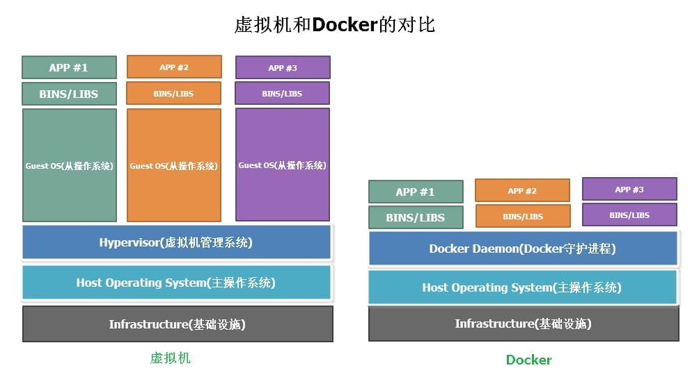
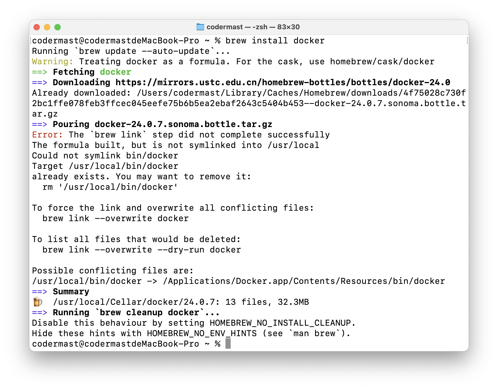
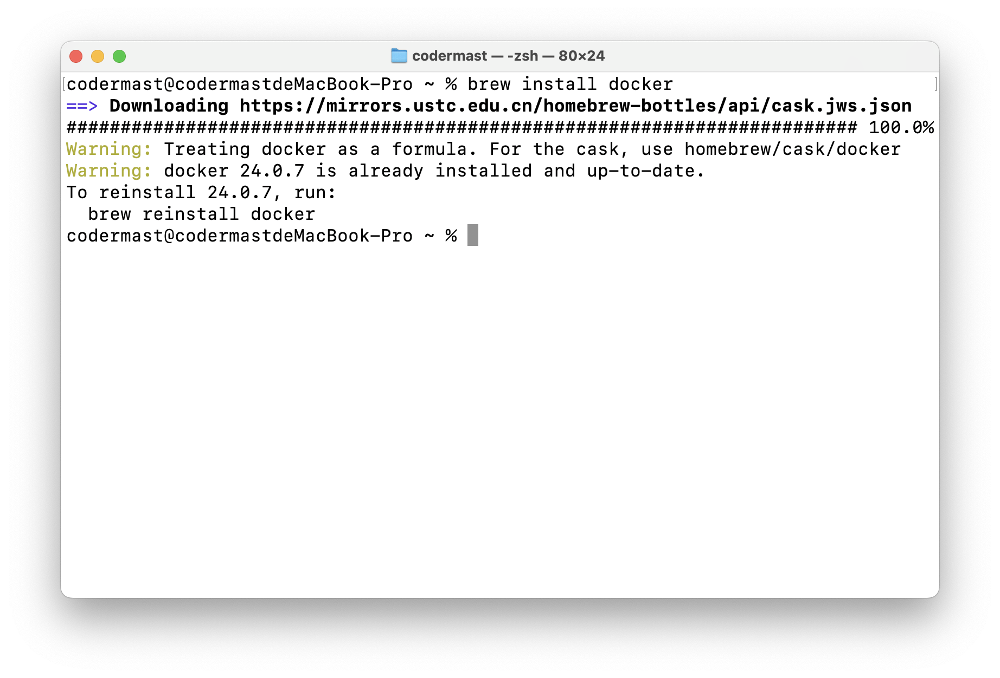
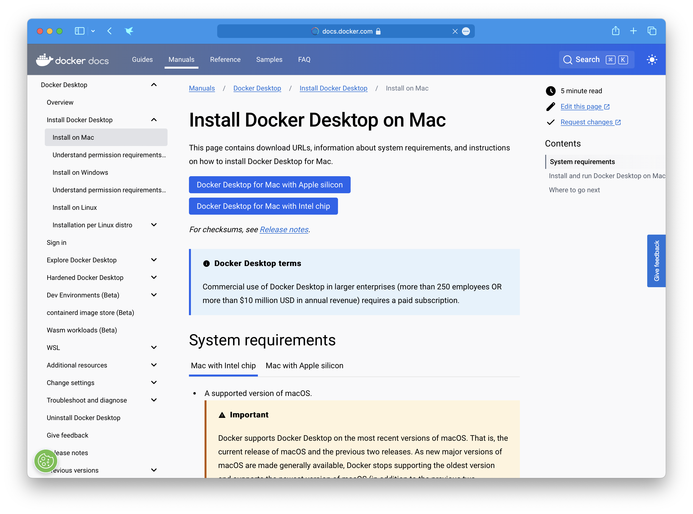
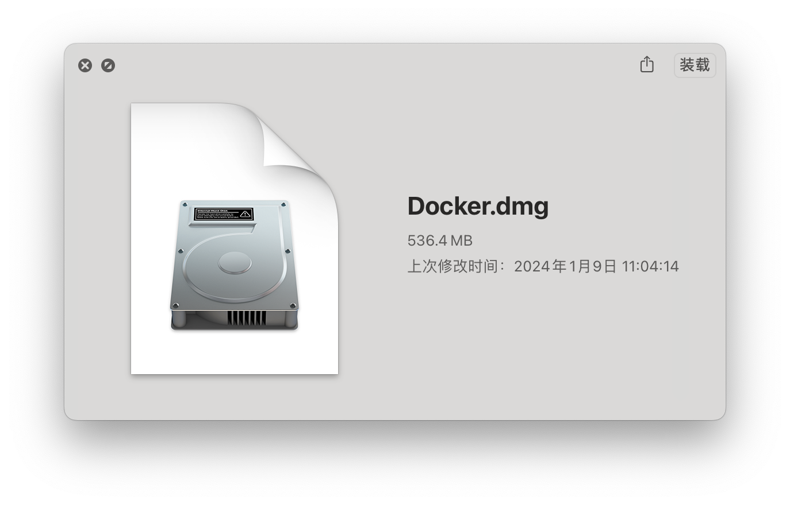
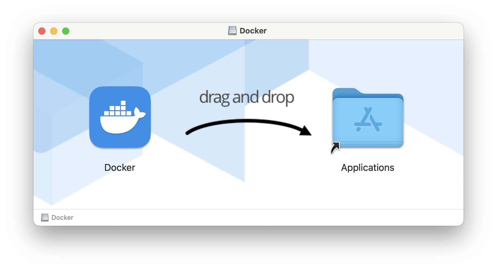

# Docker - 介绍及安装

## Docker是什么？

Docker 是一个开源的应用容器引擎，基于 Go 语言 并遵从 Apache2.0 协议开源。

Docker 可以让开发者打包他们的应用以及依赖包到一个轻量级、可移植的容器中，然后发布到任何流行的 Linux 机器上，也可以实现虚拟化。

容器是完全使用沙箱机制，相互之间不会有任何接口（类似 iPhone 的 app）,更重要的是容器性能开销极低。

Docker 从 17.03 版本之后分为 CE（Community Edition: 社区版） 和 EE（Enterprise Edition: 企业版），我们用社区版就可以了。

## Docker能干什么？

Docker是一种容器化平台，可用于打包、分发和运行应用程序及其依赖项。以下是Docker的一些主要功能和用途：

1. 容器化应用程序： Docker允许开发人员将应用程序及其所有依赖项打包到一个称为容器的独立单元中。这包括代码、运行时、系统工具、系统库等。容器可以在任何支持Docker的环境中运行，而不受环境差异的影响。

2. 跨平台性： Docker容器可以在不同的操作系统和云平台上运行，提供了更强大的跨平台性。无论是在开发、测试还是生产环境，都可以使用相同的容器。

3. 轻量级： Docker容器共享宿主操作系统的内核，因此它们相比于传统的虚拟机更加轻量级。这使得容器的启动速度更快，占用更少的系统资源。

4. 版本控制： Docker容器的镜像可以被版本控制，允许开发人员和运维团队轻松地追踪和回滚应用程序的版本。

5. 快速部署： Docker容器可以快速启动、停止和重新启动，提高了应用程序的部署速度。这对于微服务架构和持续集成/持续部署 (CI/CD) 策略非常有用。

6. 隔离性： Docker容器提供了进程级别的隔离，使得应用程序之间相互独立。这有助于避免由于一个应用程序的问题导致整个系统崩溃。

7. 资源优化： 多个Docker容器可以在同一台主机上并发运行，共享主机的资源。Docker通过优化资源使用，提高了系统的效率。

8. 生态系统： Docker拥有丰富的生态系统，包括Docker Hub，其中存储了大量的公共和私有Docker镜像，使得开发人员可以轻松共享和获取镜像。

总体而言，Docker通过容器化技术提供了一种便捷、灵活且高效的方式来开发、打包和部署应用程序。

## Docker和普通虚拟机的区别



可以理解为普通虚拟机是在宿主机的物理环境上，将操作系统进行虚拟化，类似于提供一个整体的虚拟环境，你可以在这个环境内干任何想干的事，而 Docker 在宿主机的基础上，仅仅只虚拟化所指定的依赖项。

虚拟机是在物理硬件层面对资源的隔离，而 Docker 是在操作系统的层面对所使用应用的隔离。

故 Docker 在性能上大大高于普通虚拟机。

||虚拟机|Docker|
|:---:|:---:|:---:|
|隔离程度|隔离操作系统|隔离所需依赖|
|资源利用率|低|高|
|运行效率|差|好|
|成本|高|低|

## 学习Docker之前，需要什么基础

在学习 Docker 之前，你需要掌握一些常用的 Linux 操作指令，至少认识一些常见的命令，能读懂即可。

::: tip 
如果您对 Linux 操作指令不太熟悉，或者您想学习 Linux ，可以参考本站的 Linux 系列学习笔记。

// TODO:Linux学习笔记
:::


## 安装

### Docker官方安装教程

- Docker Desktop For Windows ：https://docs.docker.com/desktop/install/windows-install/
- Docker Desktop For MacOS：https://docs.docker.com/desktop/install/mac-install/
- Docker Desktop For Linux：https://docs.docker.com/desktop/install/linux-install/

### 第三方安装教程

下面是本人制作的 Docker 安装图文教程，仅供参考使用

:::: tabs
@tab MacOS

**1.使用 Homebrew 安装**

```sh
brew install docker
```



如果你的电脑没有安装Docker，则会自动进行安装。



如果你的电脑已经安装了Docker，就显示已经安装。

::: tip
由于涉及到应用的安装，系统会进行拦截，在这期间可能会需要输入电脑的密码，输入即可。
:::

**2.手动下载安装**

手动下载的是 Docker 的桌面管理程序，安装打开后会自动检测系统当前的 Docker 环境。

下载地址：https://docs.docker.com/desktop/install/mac-install/



Docker官方提供了Intel、Apple芯片两种，选择自己电脑的版本下载即可。

> - M系列芯片，就选择Apple芯片。如：M1、M2、M3系列
> - Intel 系列芯片，就选择 Intel 芯片。如：i5、i3、i7系列

下载好的文件为 Docker.dmg，双击打开即可。





将 Docker 图标拖动至 Applications 文件夹，或者双击 Docker 图标即可进行安装。


@tab Windows

Docker 并不是一个通用的容器工具，它依赖于已存在并运行的 Linux 内核环境。

Docker 实质上是在已经运行的 Linux 下制造了一个隔离的文件环境，因此它执行的效率几乎等同于所部署的 Linux 主机。

因此，Docker 必须部署在 Linux 内核的系统上。如果其他系统想部署 Docker 就必须安装一个虚拟 Linux 环境。

::: note 
博客园上这篇安装教程写的比较详细，Windows安装遇到问题的朋友可以参考一下。
https://www.cnblogs.com/Can-daydayup/p/15468591.html
:::

下面的下载是 Docker 桌面管理程序的下载地址：

- 官网下载：https://desktop.docker.com/win/main/amd64/Docker%20Desktop%20Installer.exe

官网下载速度可能会比较慢，这里提供一个国内的下载镜像，速度会比较快。

- 国内镜像：https://smartidedl.blob.core.chinacloudapi.cn/docker/20210926/Docker-win.exe


::: warning
博主目前只有一台 MacOS 的电脑，无法制作更详细的 Windows 平台下的安装教程，后续会更新。
:::


@tab Linux

执行 Docker 官方提供的安装脚本安装即可。

```sh
curl -fsSL https://test.docker.com -o test-docker.sh
sudo sh test-docker.sh
```
::::
