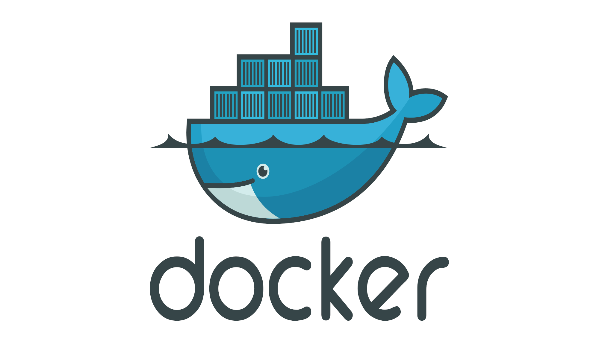

# Docker

<Catalog />

## 为什么要写这个系列？

现在是一个信息爆炸的时代，网上的开源教程非常多也非常优秀，那么我什么还要重复造轮子呢？在我搜集这些学习资料的过程中，主要的获取渠道为官网、CSDN、博客园、Bilibili、Github 等，官网大多数情况下只提供英文下的完整文档，作为母语为中文的我，阅读起来十分不方便，且其他渠道的资源零零散散，Bilibili 上有一些优质视频项目，但提供的文档要么不完整，要么就需要收费，在收集资源的过程中浪费了大量的时间精力。

另外，这些教程绝大多数站在技术人员的角度，并未深入了解用户的痛点，即是好的技术视频，但不是好的教学视频。

故下定决定，编写一套长期维护，且适合用户的学习教程。