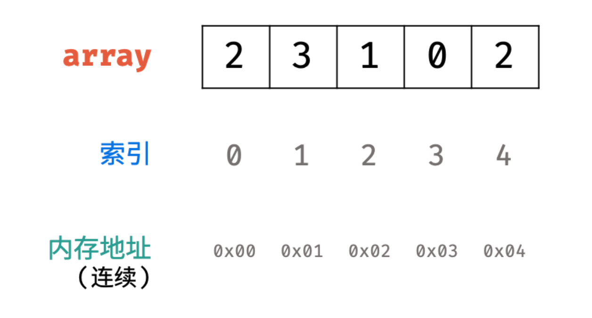

# 7. 数组和切片

在 Golang 中提供了数组类型的数据结构，可以用于存储相同类型的数据集合。除此之外，Golang 中还提供了一个切片类型，切片是对数组的抽象。在使用上，两者几乎类似，但实际在功能上差距较大。

数组是固定长度的数据结构，一旦初始化，就不能更改其大小，而切片是不定长的，可以根据数据量来自动扩充。

## 数组

数组是一整块连续内存，且存储的数据类型相同，故支持随机访问。可通过下标索引进行操作。



### **声明数组**

数组声明的语法如下所示，在声明阶段就需要指定数组长度和数组的数据类型。

```go
var arrayName [arrayLength]dataType
```


### **初始化数组**

- 仅声明

在声明数组后，没有指定数组的数据，则默认会将所有的数组置为 `dataType` 类型的零值。

- 列表初始化

```go
var arrayName = [arrayLength]dataType{data1, data2, data3 ...}
```

这里值得注意的是，如果你定义的数组长度大于你给定的数据列表，那么 Golang 就默认将剩余的数据重置为零值。但是数据列表的长度不能超过数组的长度，否则会直接报错。

```go
var arr = [5]int{1, 2, 3}
fmt.Println(arr)

var arr [3]int = [3]int{1, 2, 3, 4} // 编译错误: 初始化列表中的元素个数超过数组声明的长度
// too many values in array initializer
```

遍历输出这个数组，结果为 ==[1, 2, 3, 0, 0]==

::: important 实际上这里是分两个步骤，首先进行数组定义，然后初始化，故多余的数为零值。
:::

- 未知数组长度

如果数组长度不确定，可以使用 `...` 代替数组的长度，编译器会根据元素个数自行推断数组的长度：

```go
var arr = [...]int{ 1, 2, 3, 4, 5}

fmt.Println(len(arr)) // 输出 5
```

### **访问数组**

数组支持随机访问，可通过索引下标来进行访问

1. 查看数据

```go
var arr = [5]int{ 1, 2, 3 }

fmt.Println(arr[0]) // 输出 1
fmt.Println(arr[1]) // 输出 2
fmt.Println(arr[2]) // 输出 3
fmt.Println(arr[3]) // 输出 0
fmt.Println(arr[4]) // 输出 0

// 查询子数组的值
fmt.Println(arr[1:3]) // 输出 [2,3]
```
::: tip 如果需要获取数组的子数组，可以使用切片操作符 [:] 来创建一个切片，从而实现类似子数组的效果。但需要注意的是，这并不会创建一个新的数组，而是基于现有数组创建一个切片视图。
:::

2. 修改数据

```go
var arr = [5]int{ 1, 2, 3 }

fmt.Println(arr[2]) // 输出 3

arr[2] = 4

fmt.Println(arr[2]) // 输出 4
```

### **作为参数**

数组作为参数时，传递的是数组值的拷贝，故操作形参数组，不会改变原有的数组值。

::: tip 数组作为一种数据类型，其本身也可作为数组的数据类型，即二维数组，同理即可支持多维数组。
:::

## 切片

切片的应用范围更加广泛，用于存储相同类型，但不知道数据量的数据，而且可能会有频繁的插入和删除操作。

### **声明切片**

```go
var slice []int
```

### **初始化切片**

```go
var slice = []int{ 1, 2, 3 }
slice := []int{ 1, 2, 3 }
slice := make([]int, 0, 0)
slice := new([]int) 
```

这里不难看出，切片和数组的声明和初始化几乎类似，只是切片中没有初始化长度。推荐使用 make 方法来创建切片，make 方法的三个参数依次为：数据类型，长度，容量。

因为使用 `var slice []int` 这种默认声明方式，并不会开辟内存，实际上此时的 slice 指向的是 nil 空指针，而使用 make 方法进行初始化时，指定了容量，会分配指定大小的内存空间。

::: warning 切片初始化时的长度和容量
在 make 函数中的数据类型参数不难理解，但是长度和容量这两个有什么区别呢？可以理解为长度是实际的数据长度，即有多少数据，就有多少长度，而容量是最大长度。

但是在前面说过，切片不指定长度，可以自动扩容，那到底是可以自动扩容呢？还是根据这个容量来限制呢？答案是自动扩容的，这里的容量指的是切片初始化时的容量，如果所添加的数据超过该容量，则会自动扩容，默认是扩容为当前容量的两倍。

由于扩容的性能消耗，所以在声明阶段就尽可能的给定一个可能会用到的容量，以避免因为数据的添加而导致的不断扩容。
:::


### **访问切片**

1. 访问

通过索引来访问切片，使用的方法和数组完全相同，具体如下：

```go
slice := []int{1, 2, 3, 4, 5}

// 查询索引 2 的元素
fmt.Println(slice[2]) // 输出: 3

// 查询子切片的值
fmt.Println(slice[1:3]) // 输出 [2,3]
```

2. 修改

修改切片内的数组，可直接使用下标索引进行修改。

```go
slice := []int{1, 2, 3, 4, 5}

fmt.Println(slice) // 输出: [1, 2, 3, 4, 5]

slice[3] = 10

fmt.Println(slice) // 输出: [1, 2, 3, 10, 5]
```

在 Go 1.21 中新添加了 clear 方法，可将切片中的所有数据置为零值。

```go
slice := []int{1, 2, 3, 4, 5}

fmt.Println(slice) // 输出: [1, 2, 3, 4, 5]

clear(slice)

fmt.Println(slice) // 输出: [0, 0, 0, 0, 0]
```

3. 添加

向切片中添加元素需要使用 append 函数，添加数据到切片末尾，如果切片的容量不足，append 会自动扩容。

```go
slice := make([]int,0,0)

fmt.Println(slice)  // 输出 []

slice = append(slice,1,2,3,4,5)

fmt.Println(slice)  // 输出 [1,2,3,4,5]
```

::: note append 函数
append 内置函数将元素附加到切片的末尾。如果有足够的容量，则重新许可目的地以容纳新元素。否则，将分配一个新的底层阵列。append 函数语法如下:

```go
func append(slice []Type, elems ...Type) []Type
```

append 返回更新的切片。因此，有必要存储append的结果，通常存储在保存 slice 本身的变量中： 

```go
slice = append(slice, elem1, elem2)
slice = eappend(slice, anotherSlice ...)
```

作为特殊情况，将字符串添加到 byte slice 是合法的，如下所示：

```go
stice = append([]byte("hello ")，"world" ...)
```
:::

4. 删除

切片本身并没有提供直接删除元素的接口，需要借助 append 函数来完成

```go
slice := []int{1, 2, 3, 4, 5}
fmt.Println(slice)  // 输出 [1,2,3,4,5]

// 删除后 n 个元素
slice = slice[:len(slice) - n]
fmt.Println(slice)  // 输出 [1,2,3 ...]

// 删除前 n 个元素
slice = slice[n:];
fmt.Println(slice)  // 输出 [... 3,4,5]

// 从中间指定下标删除 n 个元素
slice =  append(slice[:i], slice[i + n:]...)  
fmt.Println(slice)  // 输出 [1,2 ... 4,5]

// 删除所有元素
slice = slice[:0]
fmt.Println(slice)  // 输出 []
```

### **作为参数**

要了解切片作为参数时，首先需要了解切片的底层结构。

```go
type SliceHeader struct {
    Data uintptr    // 指针：指向底层数组。
    Len  int        // 长度：切片中的元素个数。
    Cap  int        // 容量：从切片的起始位置到底层数组的结尾的元素个数。
}
```

当将切片作为参数传递给函数时，传递的是这个切片的副本，通过切片的底层结构不难看出，实际上切片不存储数据，存储的是一个指向底层数组的指针，传递给函数的是该指针的副本，但指向的是同一个地址，故对形参修改，也会反应在原切片上。

```go
// 改变 slice 的值
func changeSliceValue(slice []int) {
    slice[len(slice) / 2] = 10
}

dataSlice := []int{1,2,3,4,5}
fmt.Println(dataSlice)  // 输出 [1,2,3,4,5]

// 修改 切片的值
changeSliceValue(dataSlice)

fmt.Println(dataSlice)  // 输出 [1,2,10,4,5]
```

但是当增加切片的长度时，此时虽然通过实际的数组指针修改了底层数组，但是由于切片的元素个数和容量是值传递，并不会对原值产生影响，故表现出来的是没有做任何修改。

```go
// 改变 slice 的长度
func changeSliceLength(slice []int) {
    slice = append(slice,6,7,8,9)
}

dataSlice := []int{1,2,3,4,5}
fmt.Println(dataSlice)  // 输出 [1,2,3,4,5]

// 修改 切片的长度
changeSliceLength(dataSlice)

fmt.Println(dataSlice)  // 输出 [1,2,3,4,5]
```

那么要是减少切片长度呢？

```go
// 改变 slice 的长度
func changeSliceLength(slice []int) {
    slice = slice[:len(slice) / 2]
}

dataSlice := []int{1,2,3,4,5}
fmt.Println(dataSlice)  // 输出 [1,2,3,4,5]

// 修改 切片的长度
changeSliceLength(dataSlice)

fmt.Println(dataSlice)  // 输出 [1,2,3,4,5]
```

结果是依然没有变化，实际上这里只是重新定义了切片的范围，原切片底层的存储数组没有发生变化，故不表现出任何变化。

那要是我将该指针指向另外一个新切片呢？答案依然是不会变化，因为你拷贝的只是指针的副本，修改操作都是通过该指针来进行的，即使将该指针指向其他地址，原切片中的指针指向的还是原来的底层数组，还是不会展现出任何变化。

::: important 总结：只有在修改切片内元素的时候，操作到了底层数组，才会展现出修改原切片的效果，其他操作都没有操作到底层数组，故不会展现出任何变化。
:::

## **区别**

在 Go 语言中，数组（`arr`）和切片（`slice`）有一些重要的区别，特别是在使用和传递时的行为有所不同。

### **数组（arr）**

1. **固定长度**：
   - 数组在声明时需要指定固定的长度，并且长度在整个生命周期中都是不可变的。
   - 声明方式：`var arr [5]int` 或 `arr := [5]int{1, 2, 3, 4, 5}`。

2. **值传递**：
   - 当将数组作为参数传递给函数时，传递的是数组的副本而不是引用。这意味着在函数内部对数组的修改不会影响外部的原始数组。

3. **性能优化**：
   - 数组是在栈上分配内存的，访问速度较快，但长度固定。

### **切片（slice）**

1. **动态长度**：
   - 切片是对数组的一层轻量级封装，它的长度和容量可以动态改变。
   - 声明方式：`var slice []int` 或 `slice := []int{1, 2, 3, 4, 5}`。

2. **引用传递**：
   - 切片在作为函数参数传递时，传递的是切片结构的副本，但仍然共享相同的底层数组。因此，在函数内部对切片的修改会影响外部的原始切片。

3. **灵活性**：
   - 可以使用切片表达式、`append` 函数等对切片进行操作，支持动态增删元素。

### **示例比较**

下面是一个简单的示例，说明数组和切片在传递和使用时的区别：

```go
package main

import "fmt"

func modifyArray(arr [5]int) {
    arr[0] = 100
    fmt.Println("函数内部修改数组:", arr) // 输出: [100 2 3 4 5]
}

func modifySlice(slice []int) {
    slice[0] = 100
    fmt.Println("函数内部修改切片:", slice) // 输出: [100 2 3 4 5]
}

func main() {
    arr := [5]int{1, 2, 3, 4, 5}
    slice := arr[:]

    modifyArray(arr)
    fmt.Println("函数外部数组不受影响:", arr) // 输出: [1 2 3 4 5]

    modifySlice(slice)
    fmt.Println("函数外部切片受影响:", slice) // 输出: [100 2 3 4 5]
}
```

### **结论**

- **数组**是固定长度、值传递的数据结构，适合用于需要静态长度的场景。
- **切片**是动态长度、引用传递的数据结构，更加灵活，适合处理动态增删元素的需求。