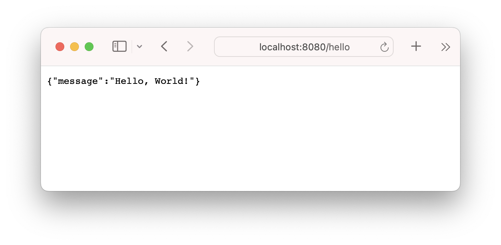

# 1. Gin 简介与环境搭建

## 1. 什么是Gin框架？

Gin是一个用Go语言编写的轻量级、高性能的Web框架。它具有以下特点：
- **速度快**：Gin的性能非常出色，适合高并发场景。
- **API友好**：Gin提供了简洁的API，易于使用。
- **中间件支持**：Gin支持中间件机制，方便扩展功能。
- **错误处理**：内置错误处理机制，简化了开发工作。

## 2. 安装Gin框架

在开始使用Gin之前，你需要安装Go语言环境。如果你还没有安装Go，可以在[Go官网](https://golang.org/dl/)下载并安装最新版本。

安装好Go后，可以使用以下命令安装Gin：

```bash
go get -u github.com/gin-gonic/gin
```

这条命令会从GitHub上下载Gin框架，并将其添加到你的Go工作区中。

## 3. 创建第一个Gin项目

现在我们可以创建一个简单的Gin项目。我们将编写一个Hello World应用来演示Gin的基本用法。

**步骤1：创建项目目录**

首先，创建一个新的目录用于存放我们的项目代码：

```bash
mkdir gin-hello-world
cd gin-hello-world
```

**步骤2：创建Go模块**

在项目目录中，初始化一个新的Go模块：

```bash
go mod init gin-hello-world
```

这将创建一个`go.mod`文件，用于管理项目的依赖关系。

**步骤3：编写代码**

在项目目录中，创建一个名为`main.go`的文件，并在其中编写以下代码：

```go
package main

import (
    "github.com/gin-gonic/gin"
)

func main() {
    // 创建一个默认的Gin路由器
    r := gin.Default()

    // 定义一个GET请求的路由和处理函数
    r.GET("/hello", func(c *gin.Context) {
        c.JSON(200, gin.H{
            "message": "Hello, World!",
        })
    })

    // 启动Gin服务器，默认监听8080端口
    r.Run() // 监听并在0.0.0.0:8080上启动服务
}
```

**步骤4：运行代码**

在项目目录中，运行以下命令来启动应用：

```bash
go run main.go
```

你应该会看到输出如下：

```bash
[GIN-debug] [WARNING] Creating an Engine instance with the Logger and Recovery middleware already attached.

[GIN-debug] GET    /hello                    --> main.main.func1 (3 handlers)
[GIN-debug] [WARNING] You trusted all proxies, this is NOT safe. We recommend you to set a value to Config.TrustedProxies.
[GIN-debug] [WARNING] Running in "debug" mode. Switch to "release" mode in production.
 - using env: export GIN_MODE=release
 - using code: gin.SetMode(gin.ReleaseMode)

[GIN-debug] Listening and serving HTTP on :8080
```

打开浏览器，访问`http://localhost:8080/hello`，你应该会看到以下JSON响应：

```json
{
    "message": "Hello, World!"
}
```



## 总结

到这里，你已经成功地安装了 Gin 框架，并创建了一个简单的 Hello World 应用。你学到了如何创建一个Gin路由器，定义一个路由和处理函数，以及如何启动 Gin 服务器。接下来，可以深入学习Gin的更多功能，例如路由参数、中间件、请求处理和响应处理等。