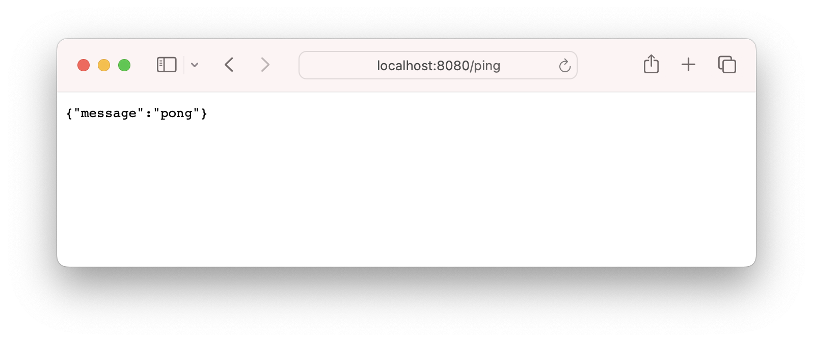
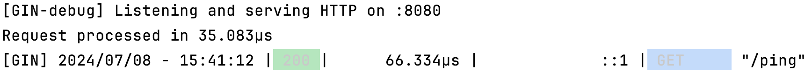

# 5. 中间件

中间件是 Gin 框架中非常重要的部分。中间件是处理请求的函数，可以在请求到达路由处理函数之前或在响应发送给客户端之前执行一些操作。中间件可以用于各种用途，如验证用户身份、记录日志、处理跨域请求等。


Gin 框架允许你全局应用中间件、对特定路由应用中间件或对路由组应用中间件。

## 1. 自定义中间件

编写自定义中间件的基本形式是一个返回 `gin.HandlerFunc` 的函数。中间件函数接受一个 `*gin.Context` 参数。

```go
package main

import (
	"fmt"
	"time"

	"github.com/gin-gonic/gin"
)

// Logger 中间件示例
func Logger() gin.HandlerFunc {
	return func(c *gin.Context) {
		// 开始时间
		startTime := time.Now()

		// 处理请求
		c.Next()

		// 计算响应时间
		endTime := time.Now()
		latency := endTime.Sub(startTime)
		fmt.Printf("Request processed in %v\n", latency)
	}
}

func main() {
	r := gin.Default()

	// 全局应用 Logger 中间件
	r.Use(Logger())

	r.GET("/ping", func(c *gin.Context) {
		c.JSON(200, gin.H{
			"message": "pong",
		})
	})

	r.Run(":8080")
}
```




## 2. 路由组中应用中间件

Gin 允许你对特定的路由组应用中间件，这样可以将中间件的作用范围限定在特定的路由组内。

```go
package main

import (
	"net/http"

	"github.com/gin-gonic/gin"
)

// AuthRequired 中间件示例
func AuthRequired() gin.HandlerFunc {
	return func(c *gin.Context) {
		// 模拟身份验证
		token := c.GetHeader("Authorization")
		if token != "valid-token" {
			c.JSON(http.StatusUnauthorized, gin.H{"error": "unauthorized"})
			c.Abort()
			return
		}
		c.Next()
	}
}

func main() {
	r := gin.Default()

	// 路由组
	auth := r.Group("/auth")
	{
		// 路由组中应用 AuthRequired 中间件
		auth.Use(AuthRequired())
		auth.GET("/profile", func(c *gin.Context) {
			c.JSON(200, gin.H{
				"user": "john",
				"role": "admin",
			})
		})
		auth.GET("/settings", func(c *gin.Context) {
			c.JSON(200, gin.H{
				"settings": "user settings",
			})
		})
	}

	r.Run(":8080")
}
```

在这个示例中，`/auth` 路由组中的所有路由都会应用 `AuthRequired` 中间件。

## 3. 处理跨域请求（CORS）

处理跨域请求是中间件的一个常见用途。可以使用第三方库（如 `github.com/gin-contrib/cors`）来简化 CORS 中间件的实现。

```go
package main

import (
	"github.com/gin-contrib/cors"
	"github.com/gin-gonic/gin"
)

func main() {
	r := gin.Default()

	// 使用 cors.Default() 中间件处理跨域请求
	r.Use(cors.Default())

	r.GET("/ping", func(c *gin.Context) {
		c.JSON(200, gin.H{
			"message": "pong",
		})
	})

	r.Run(":8080")
}
```

## 总结

学习 Gin 框架中的中间件是理解和使用 Gin 的关键。中间件可以用于：

- 记录日志
- 身份验证
- 错误处理
- 处理跨域请求

通过掌握中间件的使用方法，可以大大提高 Gin 应用的可维护性和扩展性。