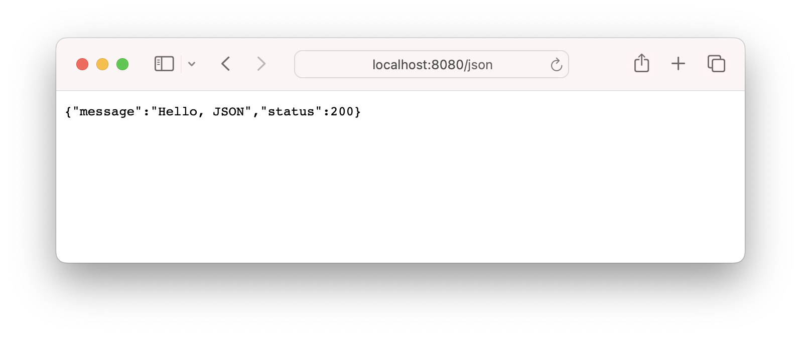
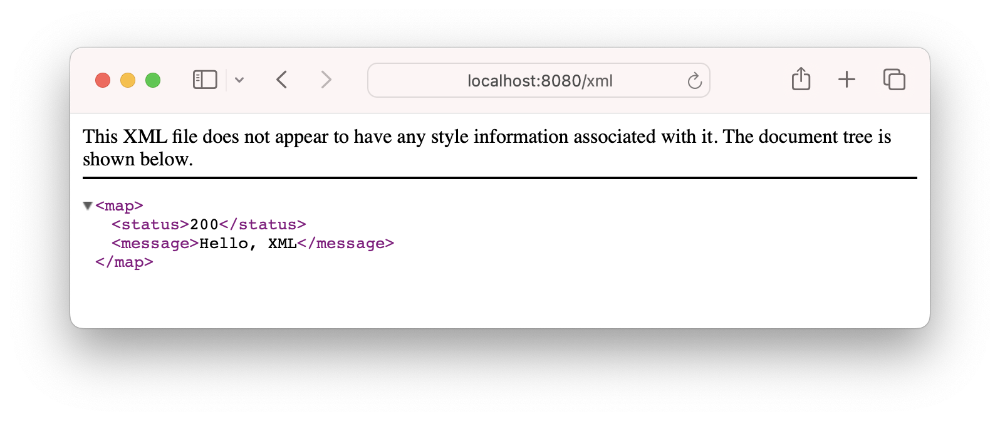
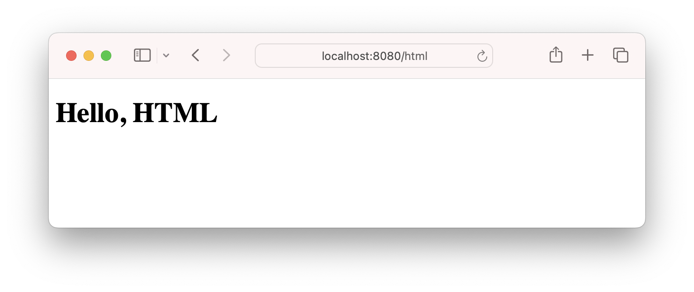
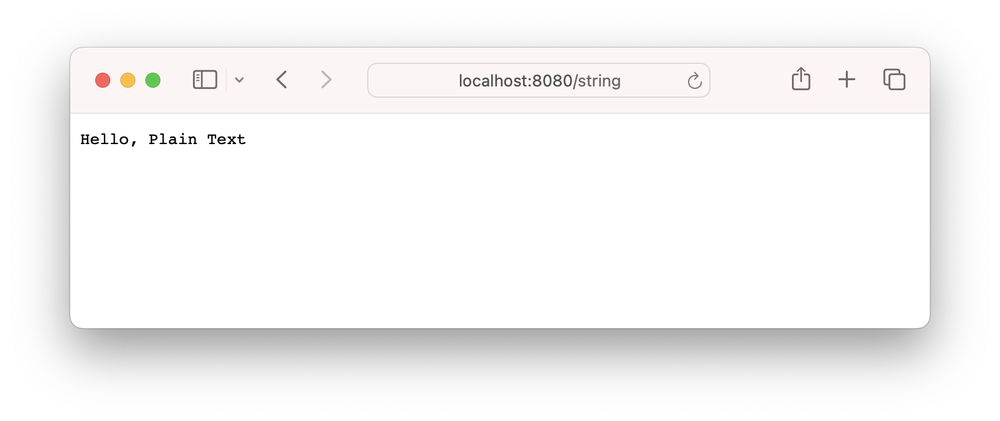
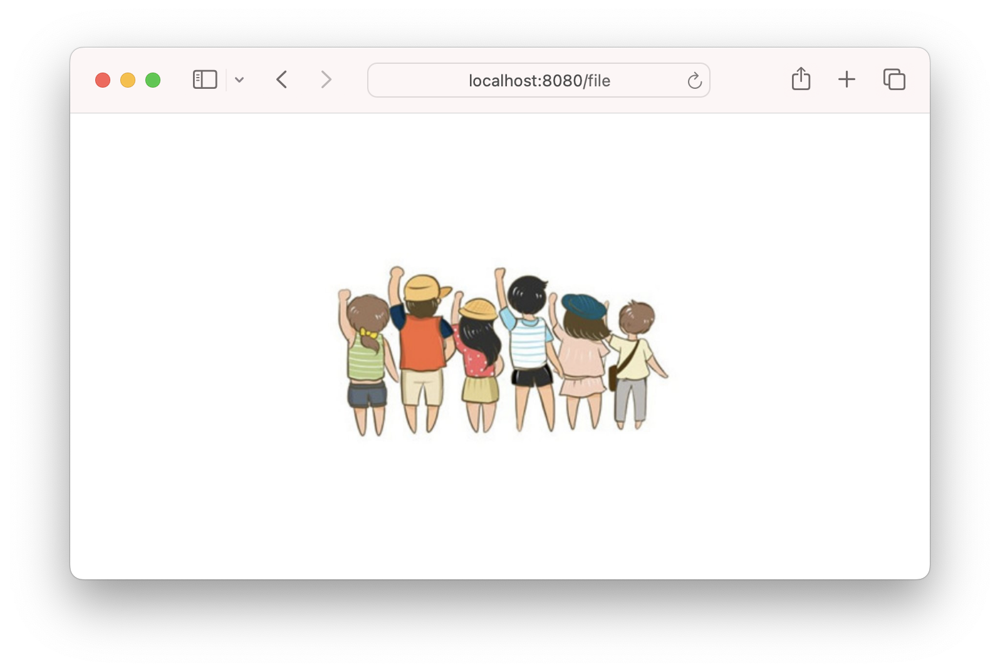
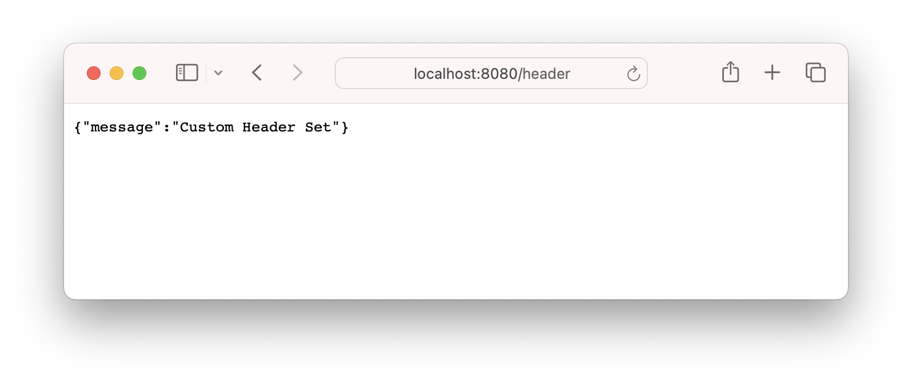
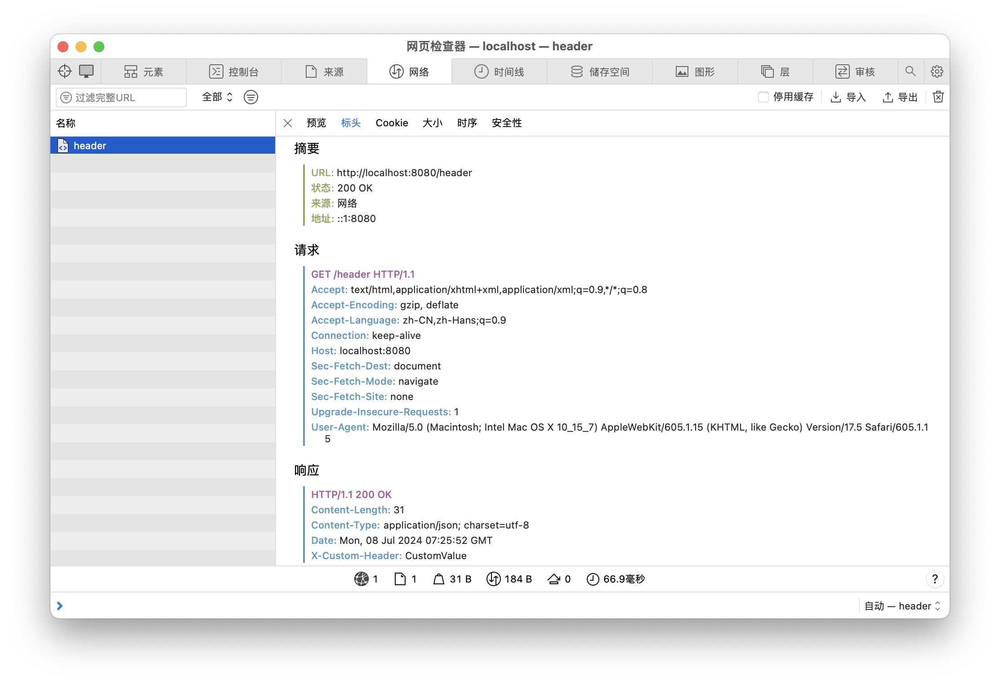
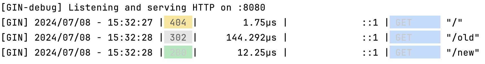
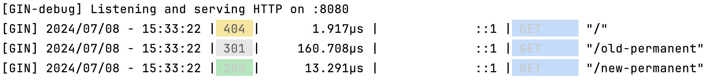
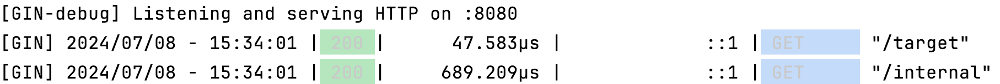

# 4. 响应

在 Gin 框架中，处理 HTTP 响应有多种方法，可以返回 JSON、XML、HTML、纯文本等格式的数据。

## JSON

使用 c.JSON 方法可以返回 JSON 格式的响应数据。

```go
package main

import (
	"net/http"

	"github.com/gin-gonic/gin"
)

func main() {
	r := gin.Default()

	r.GET("/json", func(c *gin.Context) {
		c.JSON(http.StatusOK, gin.H{
			"message": "Hello, JSON",
			"status":  200,
		})
	})

	r.Run(":8080")
}
```



## XML
使用 c.XML 方法可以返回 XML 格式的响应数据。

示例代码

```go
package main

import (
	"net/http"

	"github.com/gin-gonic/gin"
)

func main() {
	r := gin.Default()

	r.GET("/xml", func(c *gin.Context) {
		c.XML(http.StatusOK, gin.H{
			"message": "Hello, XML",
			"status":  200,
		})
	})

	r.Run(":8080")
}
```



## HTML

使用 c.HTML 方法可以返回 HTML 格式的响应数据。

```go
package main

import (
	"net/http"

	"github.com/gin-gonic/gin"
)

func main() {
	r := gin.Default()

	r.LoadHTMLGlob("templates/*")

	r.GET("/html", func(c *gin.Context) {
		c.HTML(http.StatusOK, "index.html", gin.H{
			"title": "Hello, HTML",
		})
	})

	r.Run(":8080")
}
```

- html 模板

```html
<!DOCTYPE html>
<html>
<head>
	<title>{{ .title }}</title>
</head>
<body>
	<h1>{{ .title }}</h1>
</body>
</html>
```


## 纯文本

使用 c.String 方法可以返回纯文本格式的响应数据。

```go
package main

import (
	"net/http"

	"github.com/gin-gonic/gin"
)

func main() {
	r := gin.Default()

	r.GET("/string", func(c *gin.Context) {
		c.String(http.StatusOK, "Hello, Plain Text")
	})

	r.Run(":8080")
}
```



## 文件

使用 c.File 方法可以返回文件。

这里以我的个人头像为例，实际除了图片，还可以传递多种文件格式的文件。

```go
package main

import (
	"github.com/gin-gonic/gin"
)

func main() {
	r := gin.Default()

	r.GET("/file", func(c *gin.Context) {
		c.File("path/to/file.txt")
	})

	r.Run(":8080")
}
```


## 自定义响应头

可以使用 c.Header 方法设置自定义的响应头。

```go
package main

import (
	"net/http"

	"github.com/gin-gonic/gin"
)

func main() {
	r := gin.Default()

	r.GET("/header", func(c *gin.Context) {
		c.Header("X-Custom-Header", "CustomValue")
		c.JSON(http.StatusOK, gin.H{
			"message": "Custom Header Set",
		})
	})

	r.Run(":8080")
}
```




## 重定向

重定向是一种将客户端请求引导到另一个 URL 的方法。这在处理 URL 重写、跨域请求或其他需要改变请求目标的情况下非常有用。Gin 提供了多种方法来实现 HTTP 重定向，包括临时重定向、永久重定向和重定向到内部路由。

### 1.临时重定向

使用 c.Redirect 方法可以实现临时重定向。临时重定向使用 HTTP 状态码 302。

```go
package main

import (
	"net/http"

	"github.com/gin-gonic/gin"
)

func main() {
	r := gin.Default()

	// 定义一个路由，访问 "/old" 时将临时重定向到 "/new"
	r.GET("/old", func(c *gin.Context) {
		c.Redirect(http.StatusFound, "/new")
	})

	// 新的路由
	r.GET("/new", func(c *gin.Context) {
		c.String(http.StatusOK, "This is the new route.")
	})

	r.Run(":8080")
}
```

当你访问 http://localhost:8080/old 时，服务器将返回一个 HTTP 302 重定向响应，客户端会被引导到 http://localhost:8080/new。



### 2.永久重定向

使用 c.Redirect 方法并设置状态码为 301 可以实现永久重定向。

```go
package main

import (
	"net/http"

	"github.com/gin-gonic/gin"
)

func main() {
	r := gin.Default()

	// 定义一个路由，访问 "/old-permanent" 时将永久重定向到 "/new-permanent"
	r.GET("/old-permanent", func(c *gin.Context) {
		c.Redirect(http.StatusMovedPermanently, "/new-permanent")
	})

	// 新的路由
	r.GET("/new-permanent", func(c *gin.Context) {
		c.String(http.StatusOK, "This is the new permanent route.")
	})

	r.Run(":8080")
}
```
当你访问 http://localhost:8080/old-permanent 时，服务器将返回一个 HTTP 301 重定向响应，客户端会被引导到 http://localhost:8080/new-permanent。



### 3.内部重定向

Gin 还允许你在内部重定向到另一个路由处理函数。使用 c.Request.URL.Path 和 r.HandleContext 方法可以实现这种重定向。


```go
package main

import (
	"net/http"

	"github.com/gin-gonic/gin"
)

func main() {
	r := gin.Default()

	// 定义一个路由，访问 "/internal" 时将重定向到 "/target" 路由处理函数
	r.GET("/internal", func(c *gin.Context) {
		c.Request.URL.Path = "/target"
		r.HandleContext(c)
	})

	// 目标路由
	r.GET("/target", func(c *gin.Context) {
		c.String(http.StatusOK, "This is the target route.")
	})

	r.Run(":8080")
}
```
当你访问 http://localhost:8080/internal 时，Gin 将内部重定向到 http://localhost:8080/target 路由的处理函数，而无需客户端感知到重定向。




## 响应类型列表

实际上 Gin 不仅仅支持这几种格式，还支持其他格式，这里仅演示了常用的响应格式，其他可参考下述列表。


::: important Gin 框架提供了一些内置的方法来简化响应的生成，支持多种数据格式。以下是 Gin 框架内置的响应方法：
1. **JSON**：返回 JSON 格式的数据。
   ```go
   c.JSON(code int, obj interface{})
   ```

2. **XML**：返回 XML 格式的数据。
   ```go
   c.XML(code int, obj interface{})
   ```

3. **YAML**：返回 YAML 格式的数据。
   ```go
   c.YAML(code int, obj interface{})
   ```

4. **ProtoBuf**：返回 Protocol Buffers 格式的数据。
   ```go
   c.ProtoBuf(code int, obj interface{})
   ```

5. **String**：返回纯文本字符串。
   ```go
   c.String(code int, format string, values ...interface{})
   ```

6. **HTML**：返回渲染后的 HTML 页面。
   ```go
   c.HTML(code int, name string, obj interface{})
   ```

7. **File**：发送文件到客户端。
   ```go
   c.File(filepath string)
   ```

8. **FileAttachment**：发送文件到客户端，并指定文件名。
   ```go
   c.FileAttachment(filepath, filename string)
   ```

9. **FileFromFS**：从指定的文件系统中发送文件到客户端。
   ```go
   c.FileFromFS(filepath string, fs http.FileSystem)
   ```

10. **Data**：发送原始二进制数据。
    ```go
    c.Data(code int, contentType string, data []byte)
    ```

11. **Redirect**：发送重定向响应。
    ```go
    c.Redirect(code int, location string)
    ```

12. **IndentedJSON**：返回缩进格式的 JSON 数据（便于阅读）。
    ```go
    c.IndentedJSON(code int, obj interface{})
    ```

13. **SecureJSON**：返回安全的 JSON 数据，防止 JSON 劫持。
    ```go
    c.SecureJSON(code int, obj interface{})
    ```

14. **AsciJSON**：返回 ASCII 格式的 JSON 数据。
    ```go
    c.AsciiJSON(code int, obj interface{})
    ```

15. **JSONP**：返回 JSONP 格式的数据，支持跨域请求。
    ```go
    c.JSONP(code int, obj interface{})
    ```

这些方法使得在 Gin 框架中生成各种格式的响应变得非常简单和直接。根据具体需求选择合适的方法来处理和返回响应数据。
:::