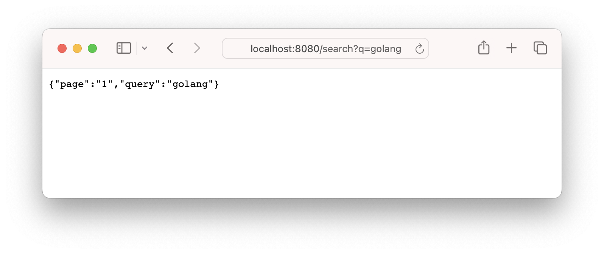

# 2. 路由

## Restful API

RESTful API 的规范建议我们使用特定的 HTTP 方法来对服务器上的资源进行操作。

- Get：获取信息
- Post：新增信息
- Delete：删除信息
- Put：更新信息
- Patch：更新部分信息


如对 users 用户资源来操作时，`get users` 代表查询用户，`post users` 代表新增用户、`put user` 代表更新用户，`delete user` 代表删除用户，其他操作类似。

```go
// 获取指定用户
r.GET("/users/:id", func(c *gin.Context) {
    c.JSON(http.StatusOK, gin.H{"data": users})
})

// 更新指定用户
r.PUT("/users/:id", func(c *gin.Context) {
    c.JSON(http.StatusOK, gin.H{"data": users})
})

// 删除指定用户
r.DELETE("/users/:id", func(c *gin.Context) {
    c.JSON(http.StatusOK, gin.H{"data": users})
})

// 添加用户
r.POST("/users", func(c *gin.Context) {
    c.JSON(http.StatusOK, gin.H{"data": users})
})
```

## 基本路由

在Gin框架中，路由是 Web 应用的核心部分，它将客户端请求映射到处理函数。下面我们将详细介绍如何定义基本路由、处理路径参数和查询参数，以及如何使用路由组（Router Group）来组织和管理路由。


在实际的请求发送中，Gin 实际上已经帮我们封装好了大部分内容，需要我们去填的主要是路径和参数两部分内容

- 静态url：静态 URL 是指不包含任何变量或通配符的 URL，直接匹配指定的路径。在 Gin 中，可以通过 GET、POST、PUT、DELETE 等方法定义静态 URL。

```go
r.GET("/hello", func(c *gin.Context) {
    c.String(http.StatusOK, "Hello, World!")
})
```

- 路径参数：路径参数允许在 URL 中使用变量来表示动态的资源标识符或参数。在 Gin 中，路径参数使用 :param 语法来定义，并可以通过 Param 方法获取参数的值。

```go
// 路径参数
r.GET("/users/:id", func(c *gin.Context) {
    id := c.Param("id")
    c.String(http.StatusOK, "User ID: %s", id)
})
```

- 查询参数：查询参数是指在 URL 中以 ? 开头的部分，用于传递特定的参数给服务器。通常情况下，查询参数用于过滤、排序或传递额外的信息。在 Gin 中，可以通过 Query 方法来获取请求中的查询参数。

```go
// 定义查询参数路由
r.GET("/search", func(c *gin.Context) {
    // 获取查询参数
    query := c.Query("q")            // 获取单个查询参数
    page := c.DefaultQuery("page", "1") // 获取单个查询参数并设置默认值

    // 返回查询参数信息
    c.JSON(http.StatusOK, gin.H{
        "query": query,
        "page":  page,
    })
})
```

访问 `http://localhost:8080/search` 会返回`{ "page": "1", "query": "" }`，


而访问`http://localhost:8080/search?q=golang`会返回`{ "page": "1", "query": "golang" }`。



- 模糊匹配：可以使用通配符来实现模糊匹配的路由，用于匹配某种模式下的路径。通配符在 Gin 中使用 * 符号来表示。

```go
// 使用 * 通配符匹配所有 /users/** 路径
r.GET("/users/*action", func(c *gin.Context) {
    action := c.Param("action")
    c.String(http.StatusOK, "Matching /users/%s", action)
})

// 使用 Any 方法匹配所有 HTTP 方法和路径
r.Any("/", func(c *gin.Context) {
    c.String(http.StatusOK, "Hello, Gin!")
})

// 匹配所有的 URL
r.Any("/*path", func(c *gin.Context) {
    path := c.Param("path")
    c.String(http.StatusOK, "Path: %s", path)
})
```

::: warning 注意事项
- 使用 `*` 通配符时，可以匹配任意长度的路径段，但不能跨越 `/` 分隔符。
- 在路由定义中，通配符必须作为路径的最后一个元素，例如 `/users/*action` 是有效的，但 `/users/*action/more` 是无效的。
:::

## 路由组（Router Group）
路由组（Route Groups）是一种组织和管理路由的有效方式。通过路由组，可以将相关的路由归类到一个组中，共享相同的中间件或前缀，特别是在需要对一组路由应用相同的中间件时。

```go
package main

import (
    "github.com/gin-gonic/gin"
)

func main() {
    r := gin.Default()

    // 定义一个路由组
    v1 := r.Group("/v1")
    {
        v1.GET("/users", func(c *gin.Context) {
            c.JSON(200, gin.H{
                "message": "List of users in v1",
            })
        })

        v1.GET("/products", func(c *gin.Context) {
            c.JSON(200, gin.H{
                "message": "List of products in v1",
            })
        })
    }

    // 定义另一个路由组
    v2 := r.Group("/v2")
    {
        v2.GET("/users", func(c *gin.Context) {
            c.JSON(200, gin.H{
                "message": "List of users in v2",
            })
        })

        v2.GET("/products", func(c *gin.Context) {
            c.JSON(200, gin.H{
                "message": "List of products in v2",
            })
        })
    }

    // 启动Gin服务器
    r.Run()
}
```

在这个示例中：
- 我们创建了两个路由组：`/v1`和`/v2`。
- 每个路由组都有各自的路由，方便对不同版本的API进行管理。

访问`http://localhost:8080/v1/users`会返回`{"message": "List of users in v1"}`


而访问`http://localhost:8080/v2/users`会返回`{"message": "List of users in v2"}`


## 总结

通过上述内容，我们学习了如何在 Gin 中定义基本路由、处理路径参数和查询参数，以及如何使用路由组来组织和管理路由。这些知识是使用 Gin 框架开发 Web 应用的基础。接下来，可以学习 Gin 的中间件、请求处理和响应处理等高级功能。